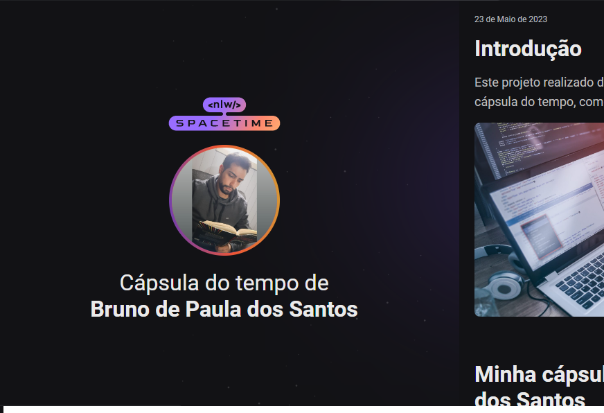

  

## 😎 Projeto
Esse é um projeto web responsivo de uma capsula do tempo para exibir memorias em uma linha do tempo.
## 🚀 Tecnologias
Esse projeto foi desenvolvido durante o NLW da Rocketseat com as seguintes tecnologias:

- HTML
- CSS
- Git e Github

<a href="https://brunosts94.github.io/MeuPortifolio/Capsula%20do%20tempoNLW2023/index.html">Visualize o Site aqui
